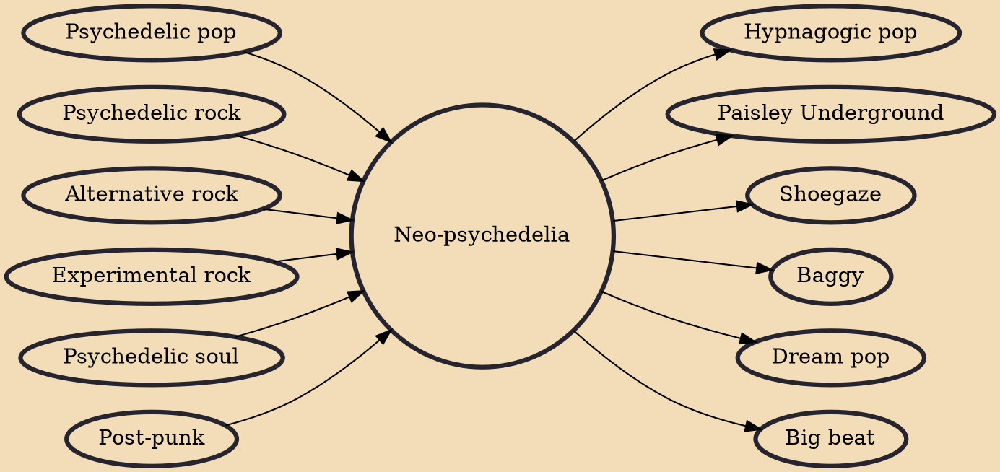

Neo-psychedelia is a diverse genre of psychedelic music that draws inspiration from the sounds of 1960s psychedelia, either updating or copying the approaches from that era. Originating in the 1970s, it has occasionally seen mainstream pop success but is typically explored within alternative rock scenes. It initially developed as an outgrowth of the British post-punk scene, where it was also known as acid punk. After post-punk, neo-psychedelia flourished into a more widespread and international movement of artists who applied the spirit of psychedelic rock to new sounds and techniques.

## Influences
- [[Psychedelic pop]]
- [[Psychedelic rock]]
- [[Alternative rock]]
- [[Experimental rock]]
- [[Psychedelic soul]]
- [[Post-punk]]

## Derivatives
- [[Hypnagogic pop]]
- [[Paisley Underground]]
- [[Shoegaze]]
- [[Baggy]]
- [[Dream pop]]
- [[Big beat]]
