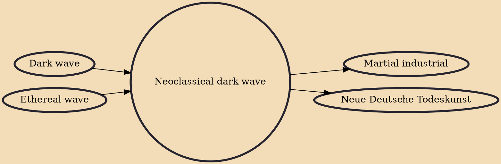

Neoclassical dark wave is a subgenre of dark wave music that is characterized by an ethereal atmosphere and soprano vocals as well as strong influences from classical music.

## Influences

- [[Dark wave]]
- [[Ethereal wave]]

## Derivatives

- [[Martial industrial]]
- [[Neue Deutsche Todeskunst]]
