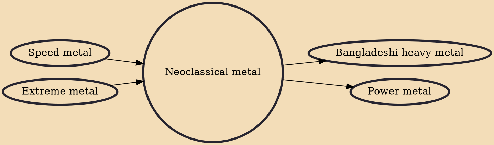

Neoclassical metal is a subgenre of heavy metal that is heavily influenced by classical music and usually features very technical playing, consisting of elements borrowed from both classical and speed metal music. Deep Purple's Ritchie Blackmore pioneered the subgenre by merging classical melodies and blues rock. Later, Yngwie Malmsteen became one of the most notable musicians in the subgenre, and contributed greatly to the development of the style in the 1980s. Other notable players in the genre are Randy Rhoads, John Petrucci, Michael Romeo, Jason Becker, Tony MacAlpine, Vinnie Moore, Uli Jon Roth, Stéphan Forté, Wolf Hoffmann, Timo Tolkki, and Marty Friedman.

## Influences
- [[Speed metal]]
- [[Extreme metal]]

## Derivatives
- [[Bangladeshi heavy metal]]
- [[Power metal]]
