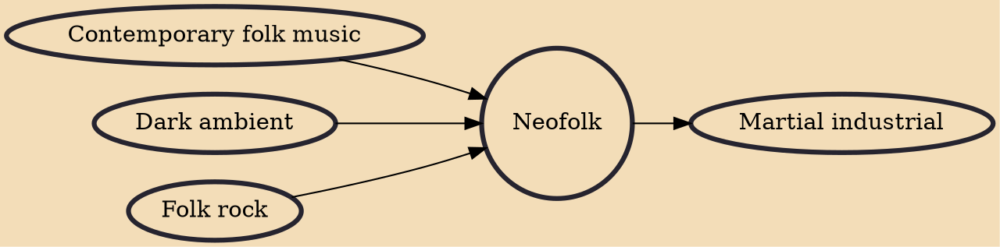

Neofolk, also known as apocalyptic folk, is a form of experimental music blending elements of folk and industrial music, which emerged in punk rock circles in the 1980s. Neofolk may either be solely acoustic or combine acoustic folk instrumentation with various other sounds.

## Influences
- [[Contemporary folk music]]
- [[Dark ambient]]
- [[Folk rock]]

## Derivatives
- [[Martial industrial]]
