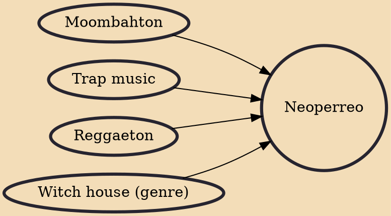

Neoperreo is a subgenre of reggaeton with some degree of popularity in Los Angeles, Mexico City, and Chile. Among the most prominent acts of the scene are Tomasa del Real from Chile and Ms Nina from Argentina. Within the United States, neoperreo is more popular in Los Angeles than in Miami, where traditional reggaeton prevails. Red Bull Music has been significant patron of neoperreo artists.

## Influences
- [[Moombahton]]
- [[Trap music]]
- [[Reggaeton]]
- [[Witch house (genre)]]
