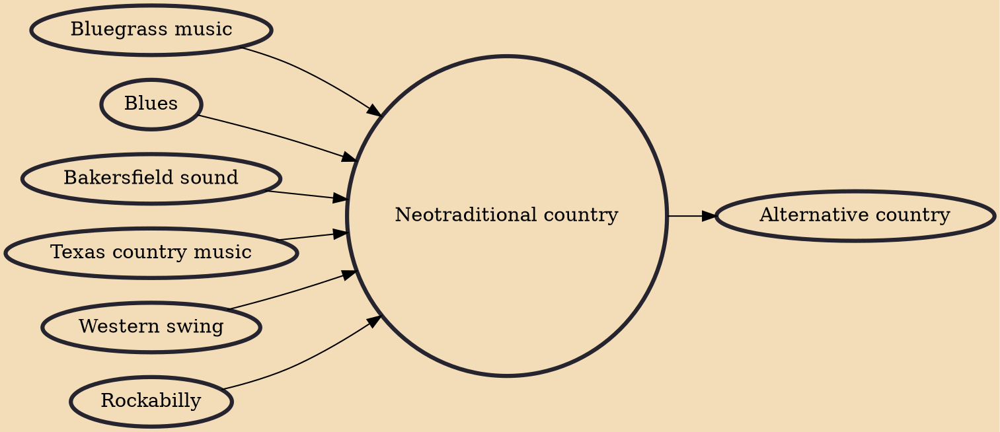

Neotraditional country (also known as new traditional country and hardcore country) is a country music style that emphasizes the instrumental background and a traditional country vocal style. Neo-traditional country artists often dress in the fashions of the country music scene of the 1940s, 1950s, and 1960s. Some new traditional artists are occasionally associated with the scene. Reba McEntire, Alan Jackson, Patty Loveless, George Strait, Randy Travis, and Toby Keith are commonly associated with this style of music.

## Influences
- [[Bluegrass music]]
- [[Blues]]
- [[Bakersfield sound]]
- [[Texas country music]]
- [[Western swing]]
- [[Rockabilly]]

## Derivatives
- [[Alternative country]]
