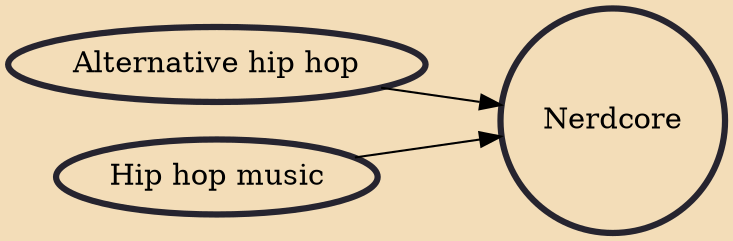

Nerdcore is a genre of hip hop music characterized by subject matter considered of interest to nerds and geeks. Self-described nerdcore musician MC Frontalot has the earliest known recorded use of the term (to describe this genre) in the 2000 song "Nerdcore Hiphop". Frontalot, like most nerdcore artists, self-publishes his work and has released much of it for free online. As a niche genre, nerdcore generally holds to the DIY ethic, and has a history of self-publishing and self-production.

## Influences
- [[Alternative hip hop]]
- [[Hip hop music]]
