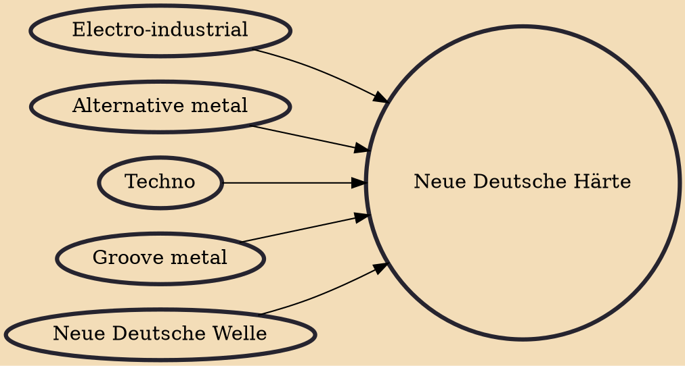

Neue Deutsche Härte (German: [ˈnɔʏə ˈdɔʏtʃə ˈhɛʁtə]; lit. "new German hardness"), sometimes abbreviated as NDH, is a subgenre of rock music that developed in Germany and Austria during the early-to-mid 1990s and during the early 2000s. Alluding to the style of Neue Deutsche Welle, the term was coined by the music press after the 1995 release of the German rock and metal band Rammstein's first studio album Herzeleid.

## Influences
- [[Electro-industrial]]
- [[Alternative metal]]
- [[Techno]]
- [[Groove metal]]
- [[Neue Deutsche Welle]]
