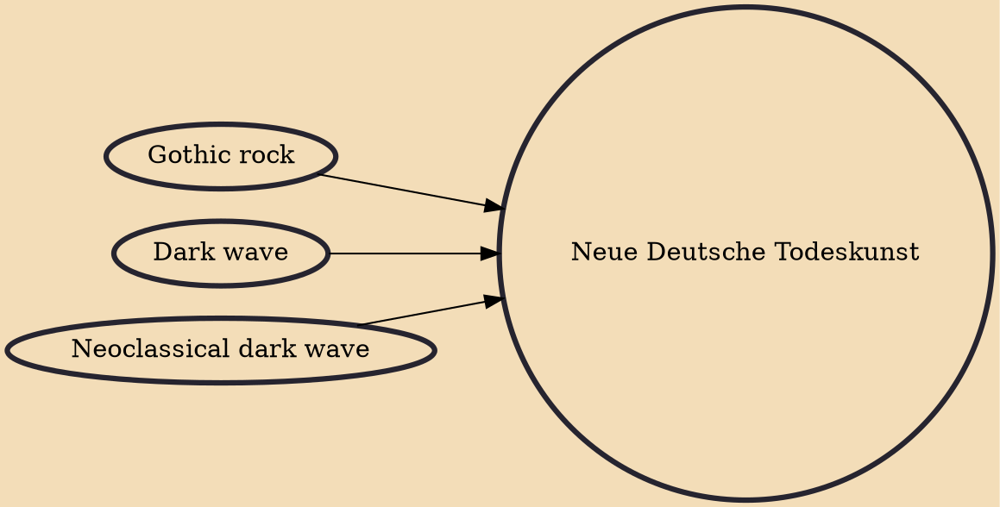

Neue Deutsche Todeskunst (NDT, lit. "New German Death Art") is a musical genre that developed in Germany in the late 1980s. It is credited with establishing the German language in the dark wave movement, although there were already such German bands as Xmal Deutschland, , and Malaria!.

## Influences

- [[Gothic rock]]
- [[Dark wave]]
- [[Neoclassical dark wave]]
