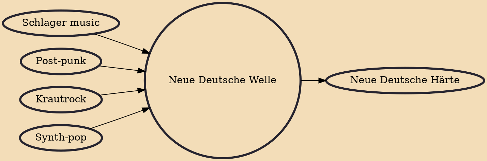

Neue Deutsche Welle (NDW, pronounced [ˈnɔʏə ˈdɔʏtʃə ˈvɛlə], "New German Wave") is a genre of West German rock music originally derived from post-punk and new wave music with electronic influences. The term was first coined by Dutch radio DJ Frits Spits on the popular nationwide radio station Hilversum 3, which was very popular among German listeners. Soon after that, the term was used in a record-shop advertisement by Burkhardt Seiler in an August 1979 issue of the West German magazine Sounds. It was then used by journalist Alfred Hilsberg in an article about the movement titled Neue Deutsche Welle — Aus grauer Städte Mauern ("New German Wave — From Grey Cities' Walls") in Sounds in October 1979.

## Influences
- [[Schlager music]]
- [[Post-punk]]
- [[Krautrock]]
- [[Synth-pop]]

## Derivatives
- [[Neue Deutsche Härte]]
