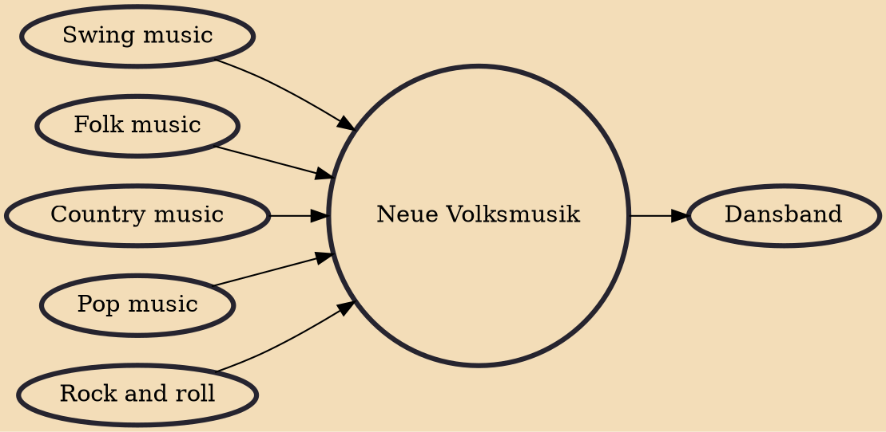

Neue Volksmusik (sometimes also called Volxmusik or Tradimix; English for "New folk music") describes the crossover mix of traditional German folk music (Volksmusik) with newer genres such as jazz, contemporary folk, electronic music, and/or rock.

## Influences

- [[Swing music]]
- [[Folk music]]
- [[Country music]]
- [[Pop music]]
- [[Rock and roll]]

## Derivatives

- [[Dansband]]
