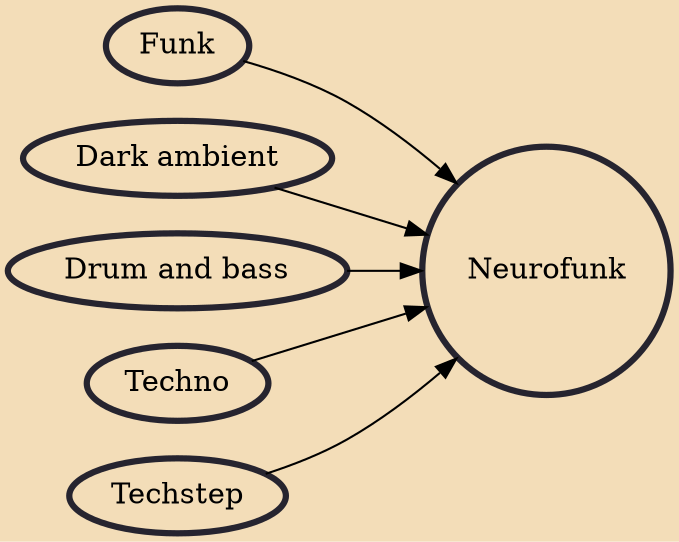

Neurofunk (also known informally as neuro) is a dark subgenre of drum and bass which emerged between 1997 and 1998 in London, England as a progression of techstep. It was further developed by juxtaposing elements of darker, heavier, and harder forms of funk with multiple influences ranging from techno, house and jazz, distinguished by consecutive stabs over the bassline; razor-sharp backbeats; scarce or nonexistent traditional melodies; a hyper focus on sub sound design; the use of modulated, distorted and filtered synthesizers and audio capture from samplers such as the Akai S1000 and Emu E6400. Neurofunk is very closely related to Techstep, but the primary characteristic that distinguishes the two genres is Neurofunk has more emphasis on flowing complex rhythms using processed and enhanc

## Influences
- [[Funk]]
- [[Dark ambient]]
- [[Drum and bass]]
- [[Techno]]
- [[Techstep]]
