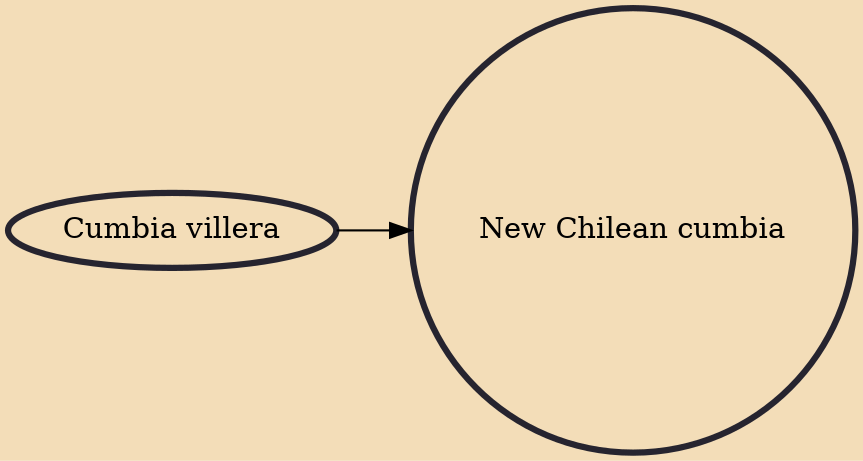

The New Chilean Cumbia also known as New Chilean Cumbia Rock (Spanish: Nueva cumbia chilena, Nueva cumbia rock chilena) is a subgenre of cumbia music that originated in Chile in the early 2000s and that largely surfaced in mainstream media in 2009 and 2010. In contrast to older cumbias the lyrics of New Chilean Cumbia deals more with urban life and combines aspects of rock, hip hop and a wide variety of Latin American genres like Andean music, salsa, the son, reggae, boleros, ska, Latin-African music, diablada and even folklore from the Balkans, like the Klezmer, and Gipsy music.

## Influences
- [[Cumbia villera]]
