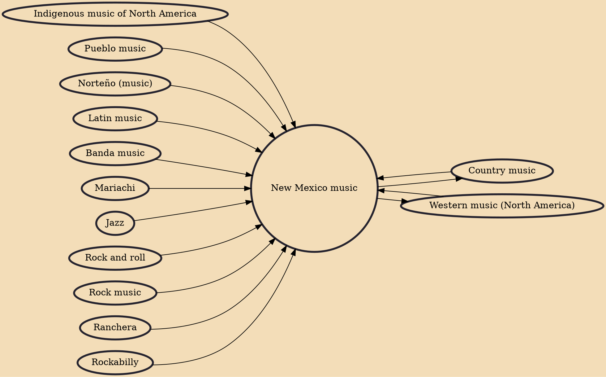

New Mexico music (Spanish: música nuevo mexicana) is a genre of music that originated in the US state of New Mexico, it derives from Pueblo music in the 13th century, and with the folk music of Hispanos during the 16th to 19th centuries in Santa Fe de Nuevo México. The language of the vocals in New Mexico music is usually Mexican and New Mexican Spanish; American and New Mexican English; Spanglish; Tiwa; Hopi; Zuni; Navajo; and/or Southern Athabaskan languages.

## Influences
- [[Indigenous music of North America]]
- [[Pueblo music]]
- [[Norteño (music)]]
- [[Latin music]]
- [[Banda music]]
- [[Mariachi]]
- [[Jazz]]
- [[Country music]]
- [[Western music (North America)]]
- [[Rock and roll]]
- [[Rock music]]
- [[Ranchera]]
- [[Rockabilly]]

## Derivatives
- [[Western music (North America)]]
- [[Country music]]
