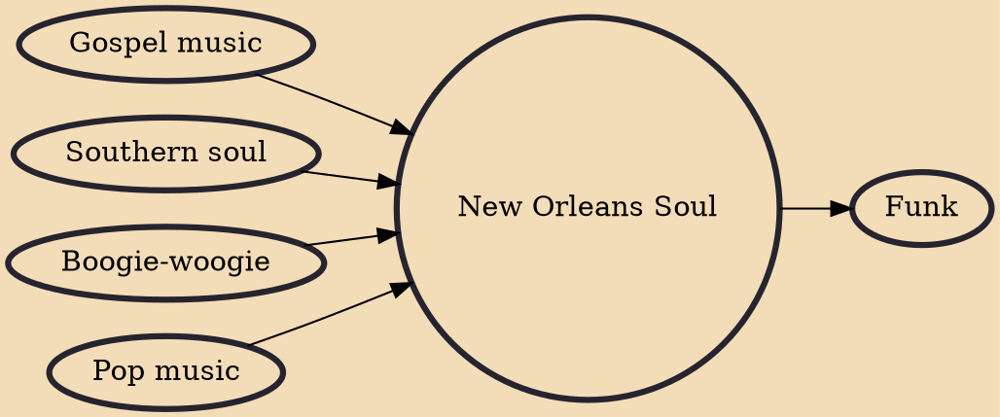

New Orleans Soul is a musical style derived from the soul music which has a large influence of the Gospel (music). New Orleans soul has ingredients of pop music and soul and is influenced by boogie-woogie style. The songs always are accompanied by a piano and a saxophone. This became known, mainly, in the postwar era, in the Crescent City.

## Influences

- [[Gospel music]]
- [[Southern soul]]
- [[Boogie-woogie]]
- [[Pop music]]

## Derivatives

- [[Funk]]
