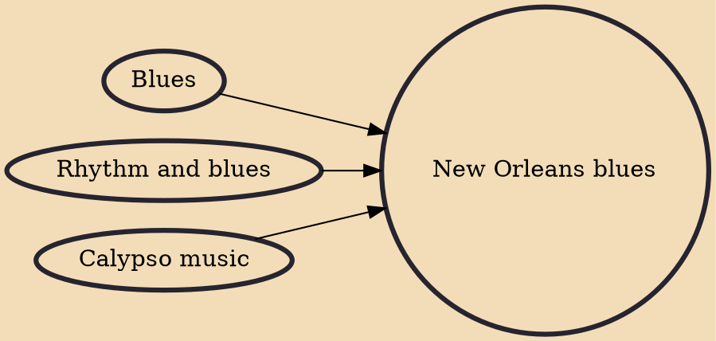

New Orleans blues is a subgenre of blues that developed in and around the city of New Orleans, influenced by jazz and Caribbean music. It is dominated by piano and saxophone, but also produced guitar bluesmen.

## Influences

- [[Blues]]
- [[Rhythm and blues]]
- [[Calypso music]]
