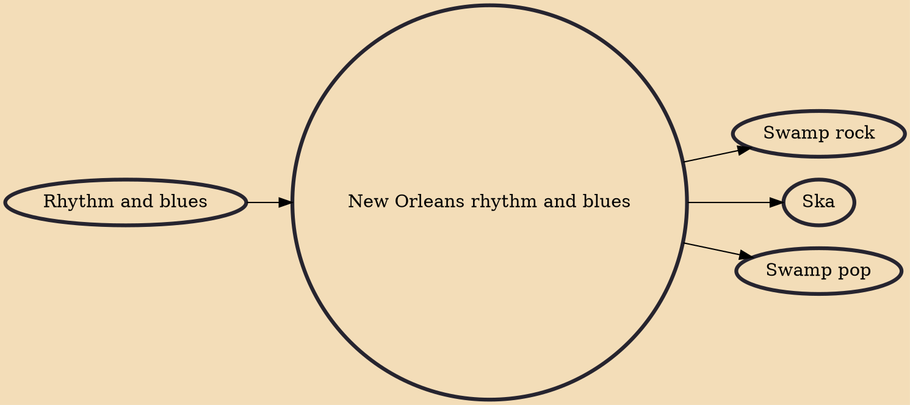

New Orleans rhythm and blues is a style of rhythm and blues that originated in New Orleans. It was a direct precursor to rock and roll and strongly influenced ska. Instrumentation typically includes drums, bass, piano, horns, electric guitar, and vocals. The style is characterized by syncopated "second line" rhythms, a strong backbeat, and soulful vocals. Artists such as Roy Brown, Dave Bartholomew, and Fats Domino are representative of the New Orleans R&B sound.

## Influences
- [[Rhythm and blues]]

## Derivatives
- [[Swamp rock]]
- [[Ska]]
- [[Swamp pop]]
