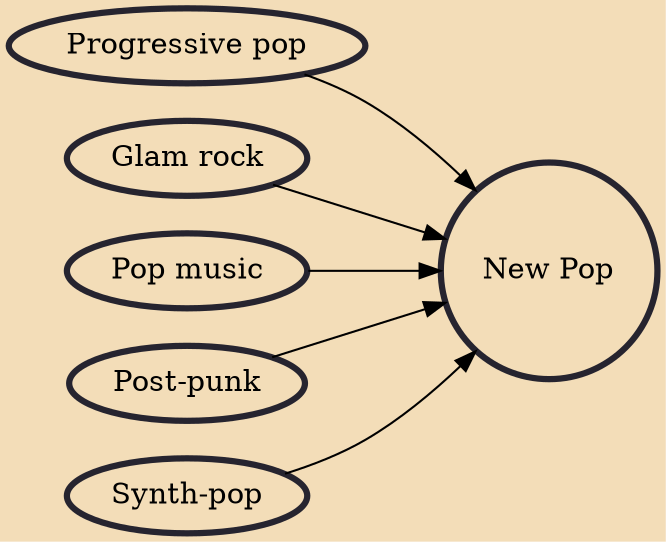

New Pop was a loosely defined British-centric pop music movement consisting of ambitious, DIY-minded artists who achieved commercial success in the early 1980s through sources such as MTV. Rooted in the post-punk movement of the late 1970s, the movement spanned a wide variety of styles and artists, including acts such as Orange Juice, the Human League and ABC. The term "rockist", a pejorative against people who shunned this type of music, coincided and was associated with New Pop.

## Influences
- [[Progressive pop]]
- [[Glam rock]]
- [[Pop music]]
- [[Post-punk]]
- [[Synth-pop]]
