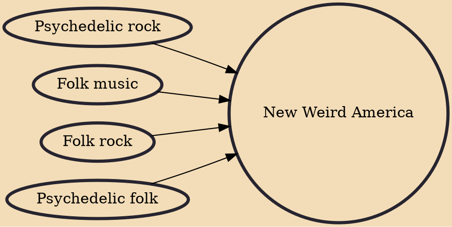

New Weird America is a 21st century style of music that primarily draws on psychedelic and folk music of the 1960s and 1970s.

## Influences

- [[Psychedelic rock]]
- [[Folk music]]
- [[Folk rock]]
- [[Psychedelic folk]]
