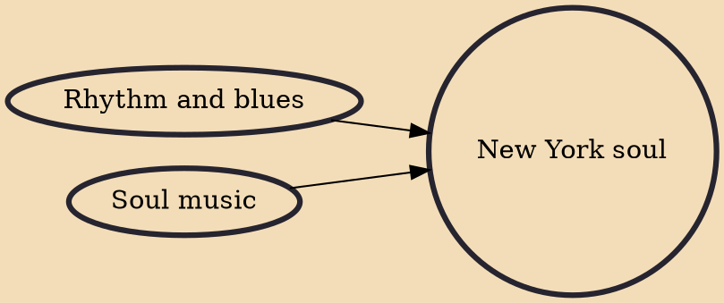

New York soul refers to the soul music recorded and produced in New York City. New York soul was similar to similar in style to Memphis soul from the southern US, but it was more likely to have string arrangements (played by string sections) added to the recordings. Unlike most southern soul, New York soul was not typically recorded by "house bands". Instead, New York soul was usually recorded by session musicians who were hired for a single recording.

## Influences

- [[Rhythm and blues]]
- [[Soul music]]
