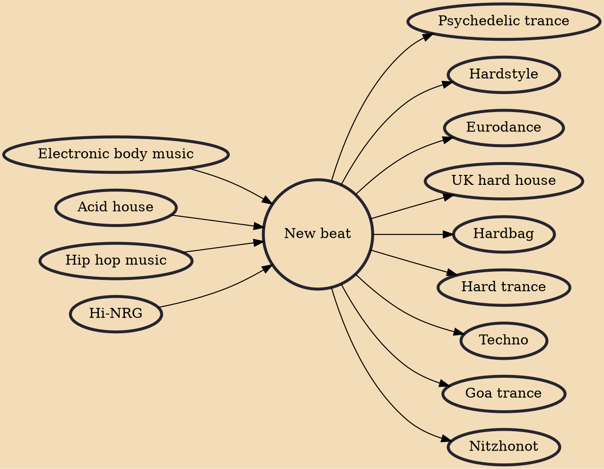

New beat is a Belgian electronic dance music genre that fuses elements of new wave, hi-NRG, EBM and hip hop (e.g. scratching). It flourished in Western Europe during the late-1980s. New beat spawned a subgenre called "hard beat" (a blend of EBM, new beat and acid house) and became a key influence on the evolution of European electronic dance music styles such as hardcore and gabber.

## Influences
- [[Electronic body music]]
- [[Acid house]]
- [[Hip hop music]]
- [[Hi-NRG]]

## Derivatives
- [[Psychedelic trance]]
- [[Hardstyle]]
- [[Eurodance]]
- [[UK hard house]]
- [[Hardbag]]
- [[Hard trance]]
- [[Techno]]
- [[Goa trance]]
- [[Nitzhonot]]
