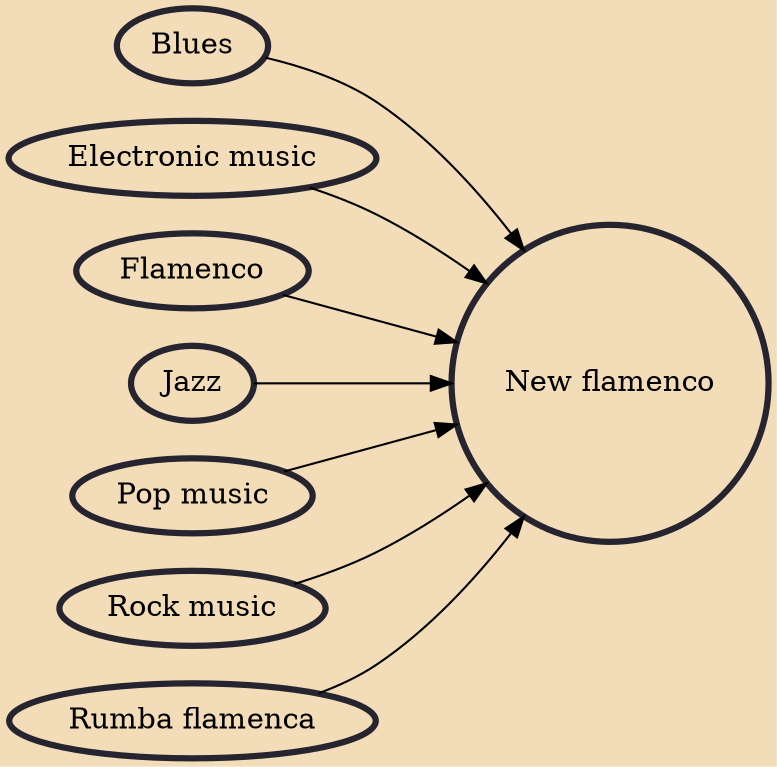

New flamenco (or nuevo flamenco) or flamenco fusion is a musical genre that was born in Spain, starting in the 1980s. It combines flamenco guitar virtuosity and traditional flamenco music with musical fusion (with genres like jazz, blues, rock, rumba, and years later reggaeton, hip hop, or electronic).

## Influences
- [[Blues]]
- [[Electronic music]]
- [[Flamenco]]
- [[Jazz]]
- [[Pop music]]
- [[Rock music]]
- [[Rumba flamenca]]
