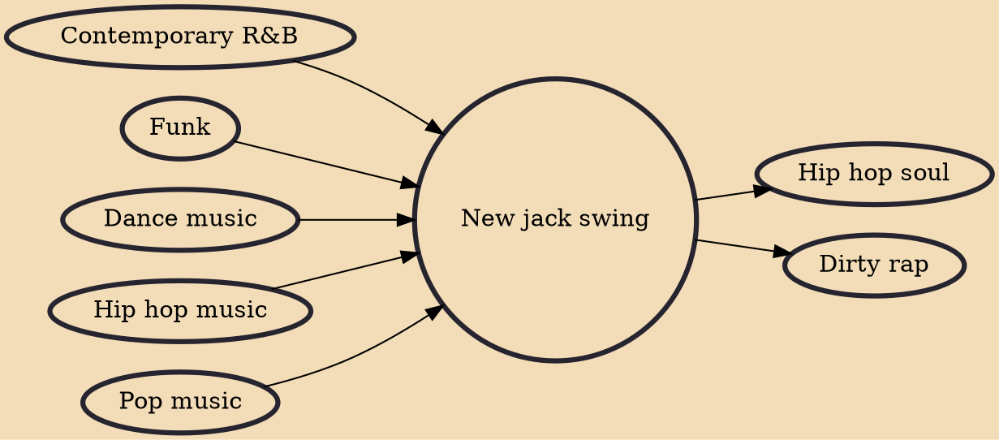

New jack swing, new jack, or swingbeat is a fusion genre of the rhythms and production techniques of hip hop and dance-pop, and the urban contemporary sound of R&B. Spearheaded by producers Teddy Riley and Bernard Belle, new jack swing was most popular from the late-1980s to early-1990s. Its influence, along with hip hop, seeped into pop culture.

## Influences

- [[Contemporary R&B]]
- [[Funk]]
- [[Dance music]]
- [[Hip hop music]]
- [[Pop music]]

## Derivatives

- [[Hip hop soul]]
- [[Dirty rap]]
