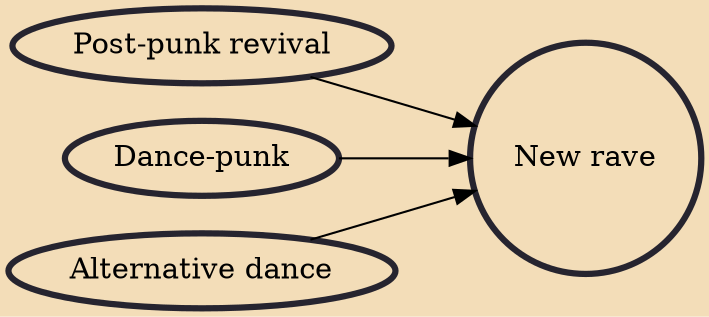

New rave (also typeset as nu-rave, nu rave or neu rave) is a genre of music described by The Guardian as "an in-yer-face, DIY disco riposte to the sensitive indie rock touted by bands like Bloc Party." It is most commonly applied to a British-based music scene between 2005 and late 2008 of fast-paced electronica-influenced indie music that celebrated the late 1980s Madchester and rave scenes through the use of neon colours and using the term 'raving' to refer to going nightclubbing.

## Influences
- [[Post-punk revival]]
- [[Dance-punk]]
- [[Alternative dance]]
