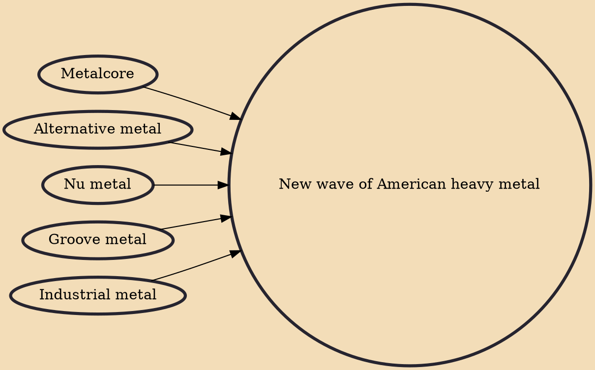

The new wave of American heavy metal (also known as NWOAHM and new wave of American metal) was a heavy metal music movement that originated in the United States during the early–mid 1990s and expanded most in the early to mid-2000s. Some of the bands considered part of the movement had formed as early as the late 1980s, but did not become influential or reach popular standing until the following decade. The term itself borrows from the new wave of British heavy metal dating to 1979. NWOAHM includes a wide variety of styles, including alternative metal, groove metal, industrial metal, nu metal and metalcore.

## Influences
- [[Metalcore]]
- [[Alternative metal]]
- [[Nu metal]]
- [[Groove metal]]
- [[Industrial metal]]
