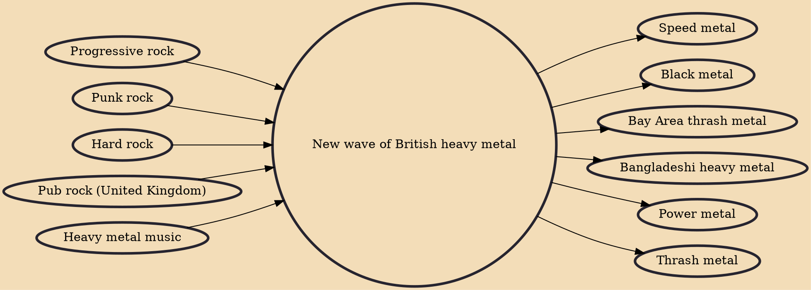

The new wave of British heavy metal (commonly abbreviated as NWOBHM) was a nationwide musical movement that started in England in the mid-1970s and achieved international attention by the early 1980s. Journalist Geoff Barton coined the term in a May 1979 issue of the British music newspaper Sounds to describe the emergence of new heavy metal bands in the mid to late 1970s, during the period of punk rock's decline and the dominance of new wave music.

## Influences

- [[Progressive rock]]
- [[Punk rock]]
- [[Hard rock]]
- [[Pub rock (United Kingdom)]]
- [[Heavy metal music]]

## Derivatives

- [[Speed metal]]
- [[Black metal]]
- [[Bay Area thrash metal]]
- [[Bangladeshi heavy metal]]
- [[Power metal]]
- [[Thrash metal]]
