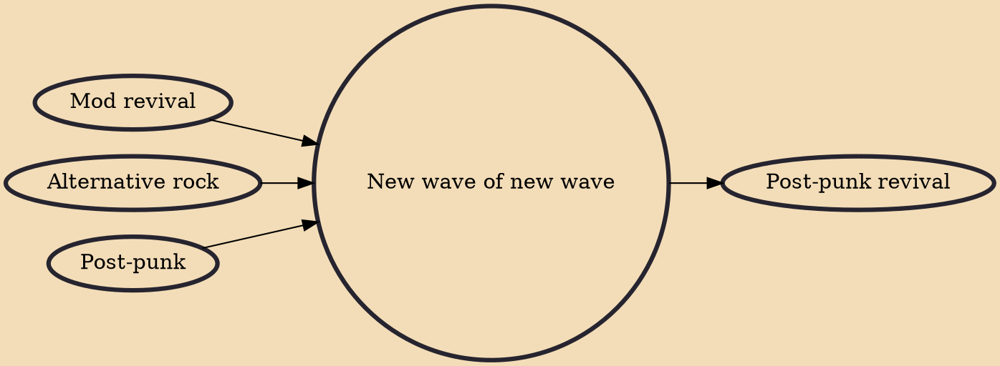

The new wave of new wave (NWONW) was a term coined by music journalists to describe a subgenre of the British alternative rock scene in the early 1990s, in which bands displayed post-punk and new wave influences, particularly from bands such as The Clash, Blondie, Wire, and The Stranglers. The associated bands generally played guitar-based rock music often accompanied by keyboards. The movement was short-lived, and several of the bands involved were later linked with the more commercially successful Britpop, which it immediately preceded, and the NWONW was described by John Harris of The Guardian (one of the journalists who first coined the term) as "Britpop without the good bits". The NME played a major part in promoting and covering the genre, and promoted the On event, which featured ma

## Influences

- [[Mod revival]]
- [[Alternative rock]]
- [[Post-punk]]

## Derivatives

- [[Post-punk revival]]
