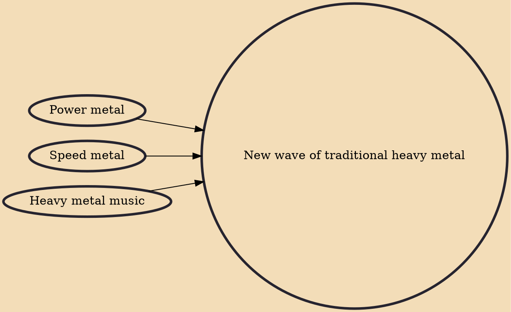

The new wave of traditional heavy metal (N.W.O.T.H.M.) is a musical movement that started in the mid-2000s as a revival of classic metal sound from the 1970s and 1980s. The term is used to describe bands that make heavy use of the elements and style of that era of metal music.

## Influences

- [[Power metal]]
- [[Speed metal]]
- [[Heavy metal music]]
