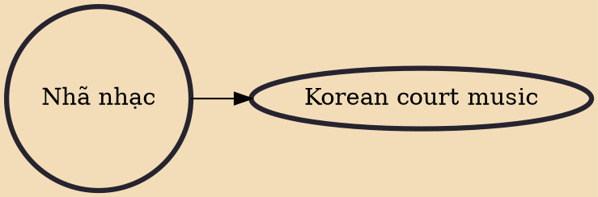

Nhã nhạc (Vietnamese: [ɲǎːˀ ɲàːk], 雅樂, "elegant music") is a traditional music of Vietnam. Vietnamese court music is very diverse, but the term nhã nhạc refers specifically to the Vietnamese court music performed from the Trần dynasty of the 13th century to the Nguyễn dynasty at the end of the 20th century.

## Derivatives
- [[Korean court music]]
