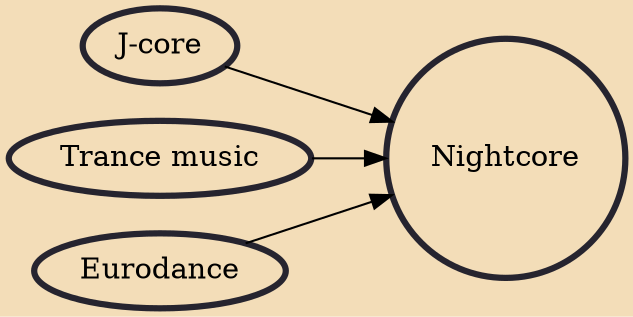

A nightcore edit is a version of a track that increases the pitch and speeds up its source material by approximately 35%. This gives an effect almost identical to playing a 33⅓-RPM vinyl record at 45 RPM. This 35% increase in RPM causes the note C4 to become slightly lower in pitch than the note F#4 (261.63 Hz becomes 353.19 Hz) which is an increase of approximately 5 and a half semitones.

## Influences
- [[J-core]]
- [[Trance music]]
- [[Eurodance]]
