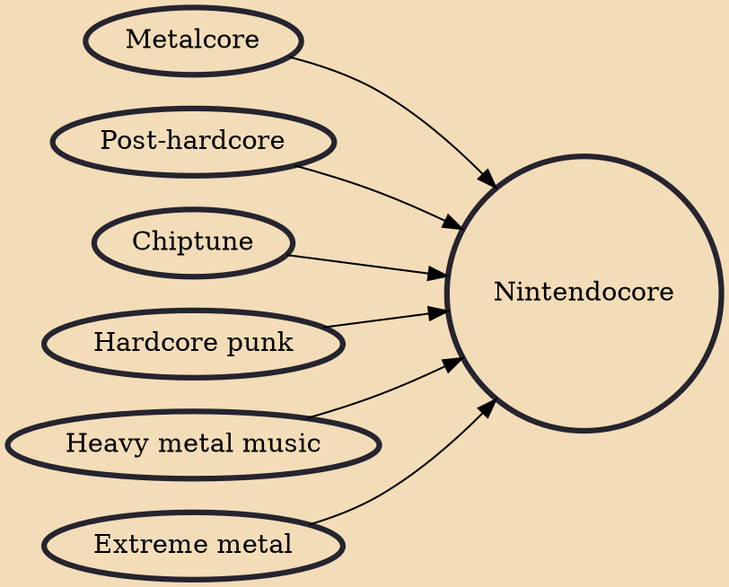

Nintendocore is a broadly defined style of music that most commonly fuses chiptune and video game music with hardcore punk and/or heavy metal. The genre is sometimes considered a direct subgenre of post-hardcore and a fusion genre between metalcore and chiptune. The genre originated in the early 2000s and peaked around the late 2000s with bands like Horse the Band, An Albatross, The NESkimos and Minibosses pioneering the genre.

## Influences
- [[Metalcore]]
- [[Post-hardcore]]
- [[Chiptune]]
- [[Hardcore punk]]
- [[Heavy metal music]]
- [[Extreme metal]]
