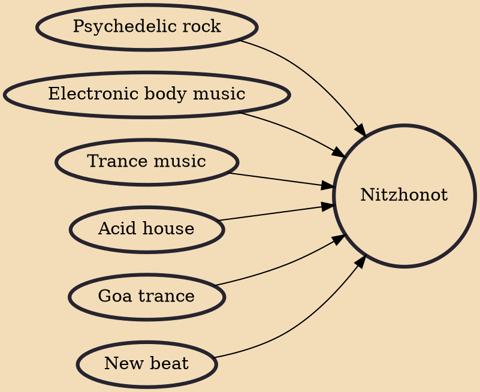

Nitzhonot (Hebrew: נצחונות, "victories") is a form of Goa trance, fused with Uplifting trance, that emerged during the mid-late 1990s in Israel.

## Influences
- [[Psychedelic rock]]
- [[Electronic body music]]
- [[Trance music]]
- [[Acid house]]
- [[Goa trance]]
- [[New beat]]
