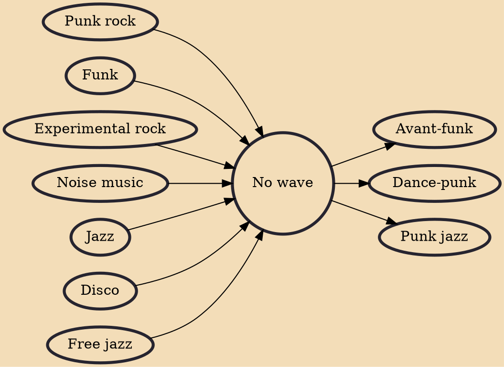

No wave is a music genre, named for the transient avant-garde music and visual art scene from which it emerged in the late 1970s in downtown New York City. The term "no wave" was a pun based on the rejection of commercial new wave music. Reacting against punk rock's recycling of rock and roll clichés, no wave musicians instead experimented with noise, dissonance and atonality in addition to non-rock genres like free jazz and disco while often reflecting an abrasive, confrontational, and nihilistic worldview.

## Influences
- [[Punk rock]]
- [[Funk]]
- [[Experimental rock]]
- [[Noise music]]
- [[Jazz]]
- [[Disco]]
- [[Free jazz]]

## Derivatives
- [[Avant-funk]]
- [[Dance-punk]]
- [[Punk jazz]]
