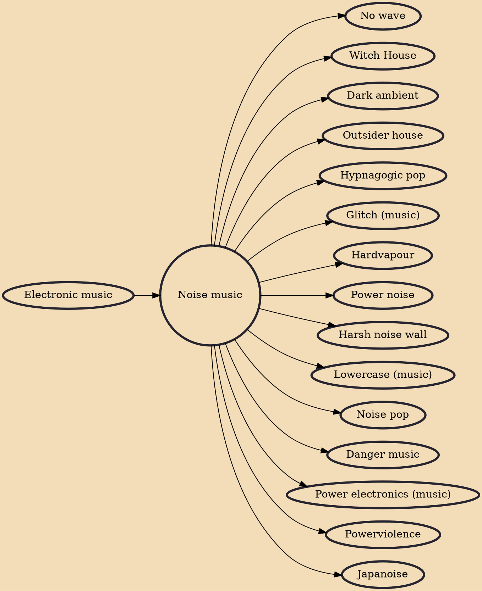

Noise music is a genre of music that is characterised by the expressive use of noise within a musical context. This type of music tends to challenge the distinction that is made in conventional musical practices between musical and non-musical sound. Noise music includes a wide range of musical styles and sound-based creative practices that feature noise as a primary aspect.

## Influences

- [[Electronic music]]

## Derivatives

- [[No wave]]
- [[Witch House]]
- [[Dark ambient]]
- [[Outsider house]]
- [[Hypnagogic pop]]
- [[Glitch (music)]]
- [[Hardvapour]]
- [[Power noise]]
- [[Harsh noise wall]]
- [[Lowercase (music)]]
- [[Noise pop]]
- [[Danger music]]
- [[Power electronics (music)]]
- [[Powerviolence]]
- [[Japanoise]]
