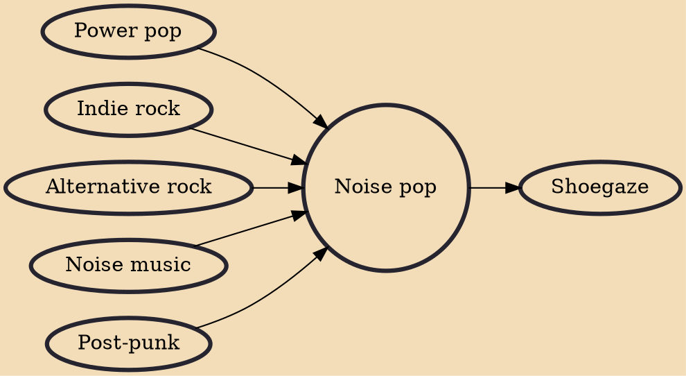

Noise pop is a subgenre of alternative and indie rock that developed in the mid-1980s in the United Kingdom and United States. It is defined by its mixture of dissonant noise or feedback with the songcraft more often found in pop music. Shoegazing, another noise-based genre that developed in the 1980s, drew from noise pop.

## Influences

- [[Power pop]]
- [[Indie rock]]
- [[Alternative rock]]
- [[Noise music]]
- [[Post-punk]]

## Derivatives

- [[Shoegaze]]
