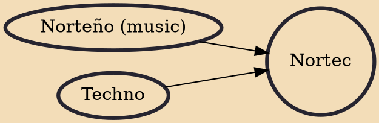

Nortec (from the combination of "norteño" and "techno") is a genre of electronic dance music developed in Tijuana (a border city in Baja California, Mexico) that first gained popularity in 2001. Nortec music is characterized by hard dance beats and samples from traditional forms of Mexican music such as Banda sinaloense and Norteño - unmistakably Mexican horns are often used. Those first raw tracks were compiled onto the "Nor-tec Sampler", the first release from Mil Records followed by the release "The Tijuana Sessions Vol. 1" and then "The Tijuana Sessions Vol. 3".

## Influences
- [[Norteño (music)]]
- [[Techno]]
