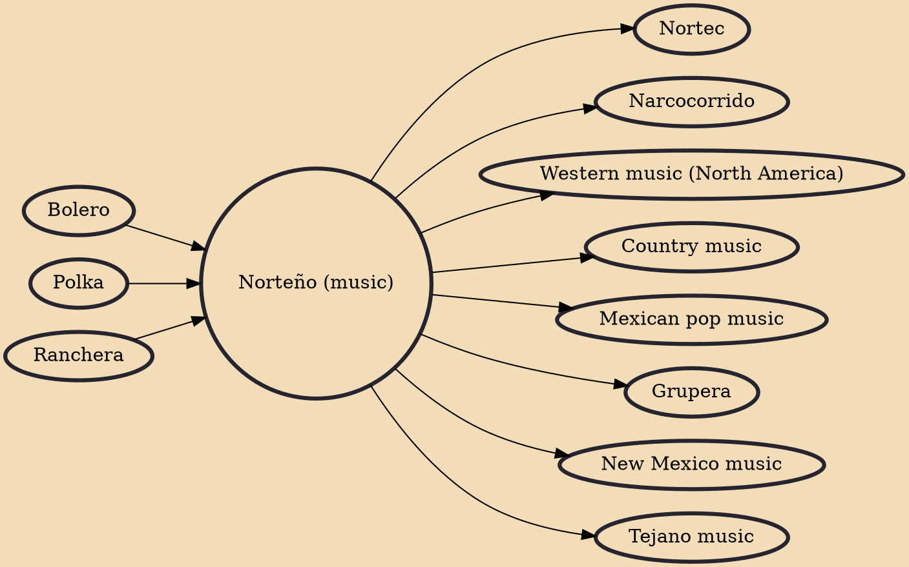

Norteño or Norteña (Spanish pronunciation: [noɾˈteɲo], northern), also música norteña, is a genre of Regional Mexican music. The music is most often based on duple and triple metre and its lyrics often deal with socially relevant topics, although there are also many norteño love songs. The accordion and the bajo sexto are traditional norteño's most characteristic instruments. Norteña music developed in the late 19th century, as a mixture between local Mexican music and Austrian-Czech-origin folk music.

## Influences
- [[Bolero]]
- [[Polka]]
- [[Ranchera]]

## Derivatives
- [[Nortec]]
- [[Narcocorrido]]
- [[Western music (North America)]]
- [[Country music]]
- [[Mexican pop music]]
- [[Grupera]]
- [[New Mexico music]]
- [[Tejano music]]
