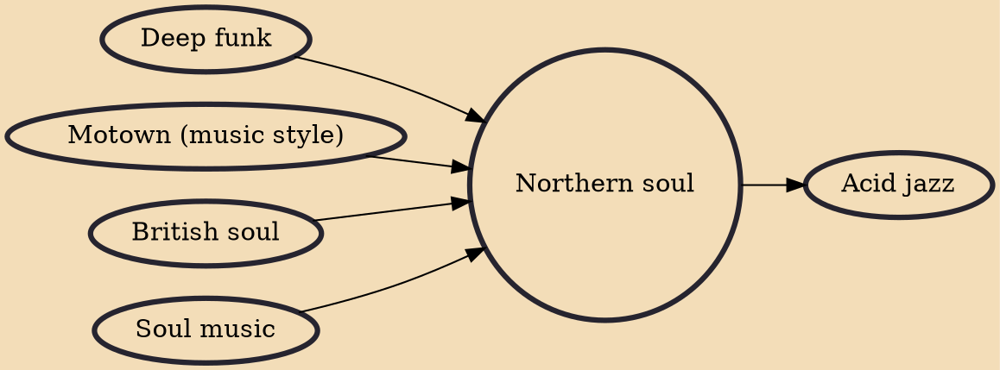

Northern soul is a music and dance movement that emerged in Northern England and the English Midlands in the late 1960s from the British mod scene, based on a particular style of Black American soul music, especially from the mid-1960s, with a heavy beat and fast tempo (100 bpm and above) or American soul music from northern cities such as Detroit, Chicago and others.

## Influences

- [[Deep funk]]
- [[Motown (music style)]]
- [[British soul]]
- [[Soul music]]

## Derivatives

- [[Acid jazz]]
