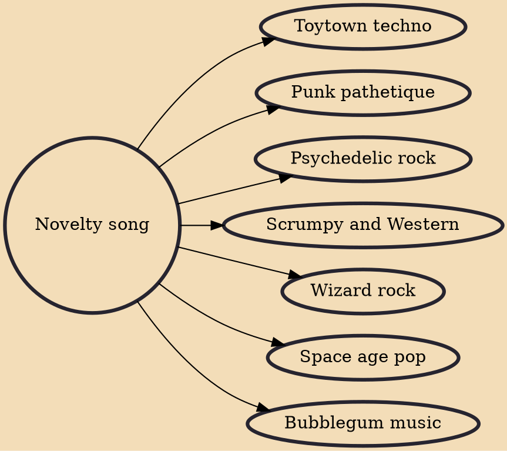

A novelty song is a type of song built upon some form of novel concept, such as a gimmick, a piece of humor, or a sample of popular culture. Novelty songs partially overlap with comedy songs, which are more explicitly based on humor, and with musical parody, especially when the novel gimmick is another popular song. Novelty songs achieved great popularity during the 1920s and 1930s. They had a resurgence of interest in the 1950s and 1960s. The term arose in Tin Pan Alley to describe one of the major divisions of popular music; the other two divisions were ballads and dance music. Humorous songs, or those containing humorous elements, are not necessarily novelty songs.

## Derivatives
- [[Toytown techno]]
- [[Punk pathetique]]
- [[Psychedelic rock]]
- [[Scrumpy and Western]]
- [[Wizard rock]]
- [[Space age pop]]
- [[Bubblegum music]]
