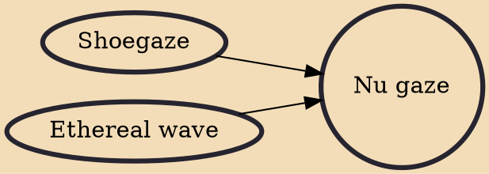

Nu gaze (sometimes called newgaze) refers to a form of alternative rock that originated in the 2000s that is directly influenced by the primarily British shoegaze scene of the late 1980s and early 1990s. A renewed interest in shoegaze occurred in the early 2000s when bands such as Maps, My Vitriol, Silversun Pickups, and The Radio Dept. first emerged across both sides of the Atlantic. The origin of the moniker "nu gaze" has been credited to an interview in 2001 with My Vitriol frontman Som Wardner in which he denied his band was shoegaze, instead stating humorously, "I guess you could call us nu gaze".

## Influences

- [[Shoegaze]]
- [[Ethereal wave]]
