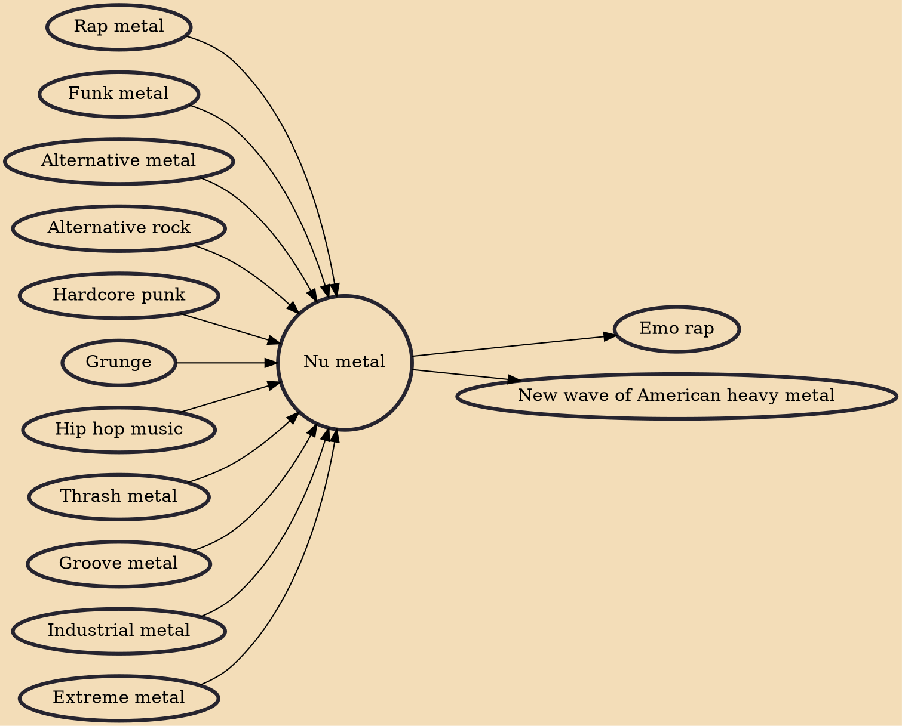

Nu metal (sometimes stylized as nü-metal, sometimes called aggro-metal) is a subgenre of alternative metal that combines elements of heavy metal music with elements of other music genres such as hip hop, alternative rock, funk, industrial, and grunge. Nu metal bands have drawn elements and influences from a variety of musical styles, including multiple genres of heavy metal. Nu metal rarely features guitar solos or other displays of technical competence; the genre is heavily syncopated and based on guitar riffs. Many nu metal guitarists use seven-string guitars that are down-tuned to produce a heavier sound. DJs are occasionally featured in nu metal to provide instrumentation such as sampling, turntable scratching and electronic backgrounds. Vocal styles in nu metal include singing, rappin

## Influences
- [[Rap metal]]
- [[Funk metal]]
- [[Alternative metal]]
- [[Alternative rock]]
- [[Hardcore punk]]
- [[Grunge]]
- [[Hip hop music]]
- [[Thrash metal]]
- [[Groove metal]]
- [[Industrial metal]]
- [[Extreme metal]]

## Derivatives
- [[Emo rap]]
- [[New wave of American heavy metal]]
