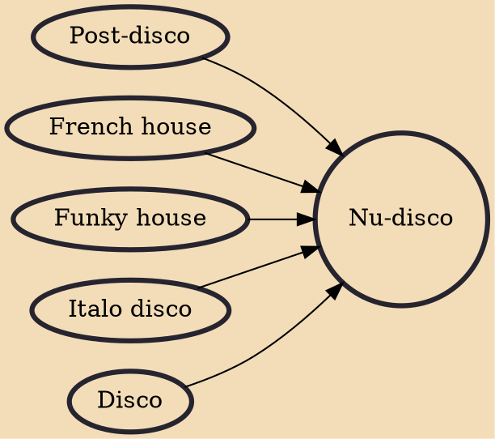

Nu-disco is a 21st-century dance music genre associated with a renewed interest in the late 1970s US disco, synthesizer-heavy 1980s European dance music styles, and early 1990s electronic dance music. The genre was especially popular in the first half of the 2000s, and experienced another mild resurgence throughout the 2010s.

## Influences

- [[Post-disco]]
- [[French house]]
- [[Funky house]]
- [[Italo disco]]
- [[Disco]]
