```dot
digraph {
	graph [bgcolor="#F3DDB8" rankdir=LR]
	node [color="#26242F" penwidth=3.0]
	"Nueva canción chilena" [shape=circle]
	"Folk music" [URL="/folk-music/"]
	"Folk music" -> "Nueva canción chilena"
}
```

Nueva canción chilena (English: new Chilean song) was a movement and genre of Chilean music incorporating strong political and social themes, taking influences from traditional or folk music of Chile. The movement was to spread throughout Latin America during the 1960s and 1970s, in what is called "Nueva canción" sparking the renewal in traditional folk music and playing a key role in political movements in the region.

## Influences
- [[Folk music]]
