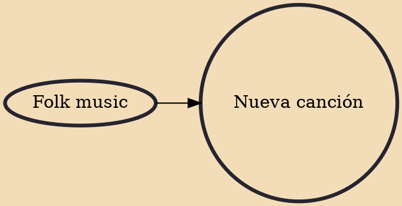

Nueva canción (European Spanish: [ˈnweβa kanˈθjon], American Spanish: [ˈnweβa kanˈsjon]; 'new song') is a left-wing social movement and musical genre in Latin America and the Iberian peninsula, characterized by folk-inspired styles and socially committed lyrics. Nueva canción is widely recognized to have played a profound role in the pro-democracy social upheavals in Portugal, Spain and Latin America during the 1970s and 1980s, and was popular amongst socialist organizations in the region.

## Influences
- [[Folk music]]
