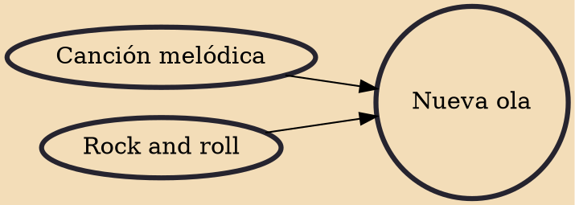

The nueva ola (pronounced ['nwe βa 'o la]; Spanish for "new wave") was a loosely affiliated group of musicians, mainly in Spanish-speaking South America, who played and introduced rock 'n roll and other American and European music of the 1950s and 1960s to their countries. The term "nueva ola" was coined in Argentina around the turn of the 1960s to denote the foreign rock and roll styles that were gaining popularity among the youth, along with their local exponents. From there, the concept spread to Chile, with exponents such as Buddy Richard, Los Carr Twins, Los Red Junior, Luis Dimas, José Alfredo Fuentes, Fresia Soto, Cecilia, Gloria Aguirre and Pat Henry. And in Peru, with exponents such as , Jimmy Santi, Los Doltons, Joe Danova, Los Silvertons, Los Belkings and Anita Martinez.

## Influences

- [[Canción melódica]]
- [[Rock and roll]]
