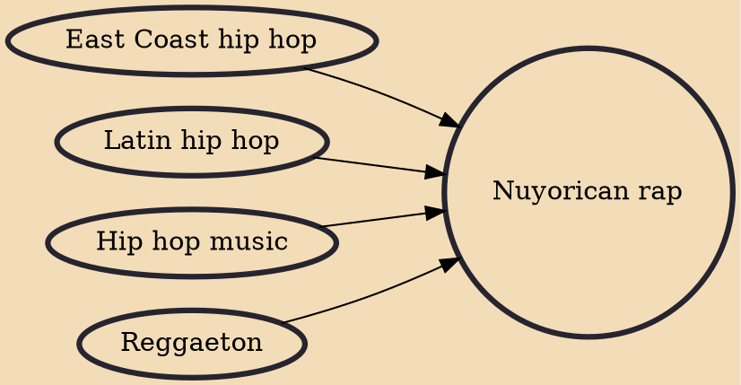

Nuyorican rap is a fusion genre of hip hop, Latin hip hop, East Coast hip hop and reggaeton that embodies aspects of East Coast Stateside Puerto Rican (Nuyorican) culture and is typically performed by American or Puerto Rican rappers and musicians of Puerto Rican descent.

## Influences
- [[East Coast hip hop]]
- [[Latin hip hop]]
- [[Hip hop music]]
- [[Reggaeton]]
