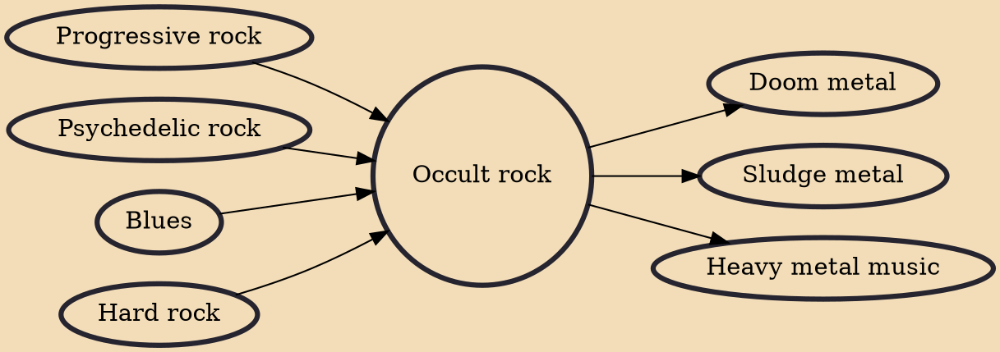

Occult rock (also known as doom rock or witch rock) is a subgenre of rock music that originated in the late 1960s to early 1970s, pioneered by bands such as Coven and Black Widow. The genre is influenced by hard rock, proto-metal, psychedelic rock, progressive rock and blues, as well as commonly incorporating lyrics referencing the occult with influences from classic horror movies to books by Dennis Wheatley. Despite the common perception, it has been noted that occult rock is not inherently gloomy nor dark, although many bands have made music with these qualities.

## Influences
- [[Progressive rock]]
- [[Psychedelic rock]]
- [[Blues]]
- [[Hard rock]]

## Derivatives
- [[Doom metal]]
- [[Sludge metal]]
- [[Heavy metal music]]
