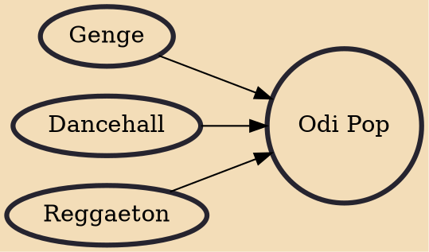

Odi pop is a Kenyan music style which involves localized hip hop and draws influences from reggae and dDancehall music to build on an African Rhythm base performed in sing-along rap in heavy Kiswahili/Sheng language. There are several sub-genres stemming from this umbrella term including Gengeton, Dabonge, Debe and others. The music is spearheaded by Kenyan youth and most of them are pursuing their careers as music groups opposed to solo careers.

## Influences
- [[Genge]]
- [[Dancehall]]
- [[Reggaeton]]
