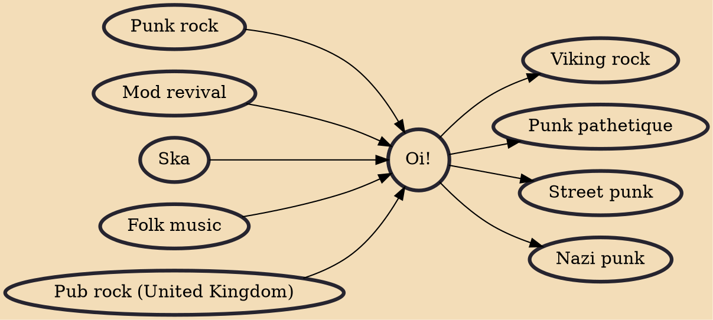

Oi! is a subgenre of punk rock that originated in the United Kingdom in the late 1970s. The music and its associated subculture had the goal of bringing together punks, skinheads, and other disaffected working-class youth. The movement was partly a response to the perception that many participants in the early punk rock scene were, in the words of The Business guitarist Steve Kent, "trendy university people using long words, trying to be artistic...and losing touch."

## Influences

- [[Punk rock]]
- [[Mod revival]]
- [[Ska]]
- [[Folk music]]
- [[Pub rock (United Kingdom)]]

## Derivatives

- [[Viking rock]]
- [[Punk pathetique]]
- [[Street punk]]
- [[Nazi punk]]
