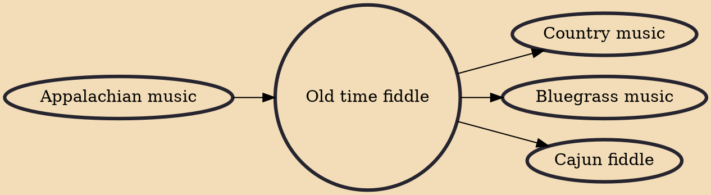

Old time fiddle is a genre of American folk music. "Old time fiddle tunes" derived from European folk dance tunes such as Jig, Reel, Breakdown, Schottische, Waltz, Two Step and Polka. The fiddle may be accompanied by banjo or other instruments but are nevertheless called "fiddle tunes". The genre traces from the colonization of North America by immigrants from England, France, Germany, Ireland, and Scotland. It is separate and distinct from traditions which it has influenced or which may in part have evolved from it, such as bluegrass, country blues, variants of western swing and country rock.

## Influences
- [[Appalachian music]]

## Derivatives
- [[Country music]]
- [[Bluegrass music]]
- [[Cajun fiddle]]
